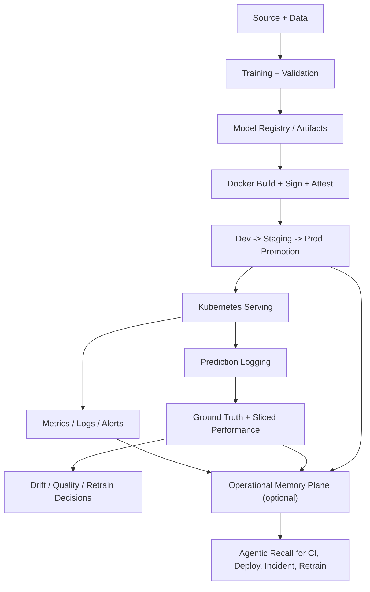

# ML-MLOps Production Template

Opinionated, production-grade template for building and operating ML systems on Kubernetes with multi-cloud deployment (GKE + EKS), governed CI/CD, closed-loop monitoring, supply-chain security, and agentic automation that stays inside enterprise guardrails.

[](https://github.com/DuqueOM/ML-MLOps-Production-Template/releases)
[](https://www.python.org/downloads/)
[](LICENSE)
[](https://www.terraform.io/)
[](https://kubernetes.io/)

[](https://github.com/DuqueOM/ML-MLOps-Production-Template/actions/workflows/validate-templates.yml)
[](https://codecov.io/gh/DuqueOM/ML-MLOps-Production-Template)
[](https://github.com/DuqueOM/ML-MLOps-Production-Template/generate)
[](#anti-patterns-encoded)
[](#agentic-system)

```bash
git clone https://github.com/DuqueOM/ML-MLOps-Production-Template.git
cd ML-MLOps-Production-Template
./templates/scripts/new-service.sh ChurnPredictor churn_predictor
```

**Start here:** [QUICK_START.md](QUICK_START.md) | [RUNBOOK.md](RUNBOOK.md) | [AGENTS.md](AGENTS.md) | [CONTRIBUTING.md](CONTRIBUTING.md)

---

## What this template is

This repository is a reference template for teams that want strong production defaults without adopting a heavyweight ML platform too early. It is intentionally opinionated where production failures are expensive and intentionally flexible where teams need domain-specific control.

It ships:

- Async ML serving patterns that avoid common Kubernetes and FastAPI failure modes.
- Multi-cloud Kubernetes and Terraform scaffolding for GCP and AWS.
- Environment promotion from `dev -> staging -> prod` with audit trail, approvals, digest-based deploys, signing, and attestations.
- Closed-loop monitoring with prediction logging, delayed ground truth, sliced performance, champion/challenger evaluation, and retraining hooks.
- Security controls for secrets, identity federation, SBOM generation, image signing, admission policy, and pod hardening.
- Agentic governance through `AUTO / CONSULT / STOP`, plus dynamic risk escalation based on live signals.
- Safe CI self-healing for low-risk failures, with bounded blast radius and mandatory verification.
- An optional Operational Memory Plane that helps agents retrieve prior incidents, decisions, deploy regressions, and successful remediations.

This is not a generic "starter repo". It is a production template with encoded operating constraints.

---

## What is production-ready here

The template is positioned as a hardened open-source baseline for enterprise ML services. After scaffold and environment wiring, the following areas are treated as production-ready:

| Area | Status | What that means |
|------|--------|-----------------|
| Service scaffold | Production-ready | FastAPI serving, async inference, contract versioning, structured errors, domain hooks, tests, and observability are wired as first-class concerns. |
| Kubernetes runtime | Production-ready | Single-worker pod model, split probes, startup gating, PDB, HPA, pod security labels, digest-pinned deploys, and non-root runtime defaults are part of the base. |
| Multi-cloud infrastructure | Production-ready | GCP and AWS both ship with environment separation, remote state, identity federation, secret manager patterns, and reproducible Terraform layouts. |
| CI/CD | Production-ready | Build, scan, sign, attest, promote, smoke-test, drift-check, retrain, and audit paths are governed and traceable. |
| Closed-loop monitoring | Production-ready | Prediction logging, ground-truth ingestion, sliced performance analysis, drift heartbeat, and champion/challenger comparisons are part of the standard operating model. |
| Security and supply chain | Production-ready | Secret scanning, SBOM, image signing, admission policy, and least-privilege cloud identity are part of the deploy contract. |
| Agentic controls | Production-ready | Static operation modes, dynamic risk escalation, typed handoffs, and auditable decisions are all encoded. |
| Operational Memory Plane | Optional companion | Recommended for larger teams or repos with frequent incident/release cycles. It augments decisions; it is not a required dependency for serving. |

External dependencies still remain your responsibility: cloud accounts, Kubernetes clusters, MLflow backend, secret stores, and observability backends must exist before the template can operate in a real environment.

---

## Quick navigation

| If you want to... | Read first | Then |
|-------------------|------------|------|
| Scaffold a new ML service | [QUICK_START.md](QUICK_START.md) | `./templates/scripts/new-service.sh` |
| Understand the operating model | [AGENTS.md](AGENTS.md) | [docs/decisions/](docs/decisions/) |
| Review deployment and rollback flow | [RUNBOOK.md](RUNBOOK.md) | `templates/cicd/` and `templates/k8s/` |
| Evaluate security posture | [SECURITY.md](SECURITY.md) | `templates/infra/`, `templates/k8s/`, `templates/cicd/` |
| Extend agentic behavior | [AGENTS.md](AGENTS.md) | `.windsurf/`, `.cursor/`, `.claude/` |
| Contribute to the template | [CONTRIBUTING.md](CONTRIBUTING.md) | This README's license and governance sections |

---

## Architecture overview



### Design principles

- The training, serving, monitoring, and retraining path is explicit and reviewable.
- The scaffolded repository is self-contained. It does not depend on hidden files from the template root after generation.
- The template uses strong defaults for production invariants and lets teams customize domain features, schema, model selection, thresholds, and integrations.
- Governance is additive. Dynamic signals can escalate a decision to a safer mode; they cannot silently weaken policy.

---

## Core capabilities

### Serving and APIs

- Async FastAPI serving with `run_in_executor` for CPU-bound inference.
- Single-worker pod model for correct HPA behavior.
- Request validation, contract versioning, snapshot-based API checks, and structured error envelopes.
- Model loading through init containers and shared volumes instead of baking models into images.
- Warm-up path for model readiness and SHAP explainer caching.

### Kubernetes and runtime

- Kustomize base plus six overlays: `gcp-dev`, `gcp-staging`, `gcp-prod`, `aws-dev`, `aws-staging`, `aws-prod`.
- CPU-only HPA, PodDisruptionBudget, NetworkPolicy, RBAC, non-root security context, and Pod Security Standards labels.
- Separate liveness, readiness, and startup probes.
- Digest-based deployment and immutable image flow.

### Infrastructure

- Terraform layouts separated by cloud and environment concerns.
- Remote state patterns for both GCP and AWS.
- Workload Identity and IRSA as the default runtime identity model.
- Example resource topology for buckets, registries, clusters, IAM, and observability prerequisites.

### CI/CD and controlled automation

- Build -> scan -> sign -> attest -> deploy -> smoke-test promotion chain.
- Drift detection and retraining workflows as first-class operational paths.
- Audit trail written to JSONL and surfaced in GitHub Actions summaries.
- Controlled CI self-healing for minor failures with policy-based limits.

### Data validation and ML quality

- Pandera-based contracts for data validation.
- Leakage checks, baseline distributions, reproducibility hooks, and configurable quality gates.
- Fairness checks, champion/challenger evaluation, and retraining evidence packages.
- Versioned artifacts and model promotion rules that are meant to fail closed.

### Observability and closed-loop monitoring

- Prometheus metrics, structured logs, Grafana dashboards, and alert rules.
- Prediction logging with `prediction_id` and `entity_id` as required primitives.
- Delayed ground-truth ingestion, sliced performance monitoring, heartbeat monitoring, and trend analysis.
- Metrics and alerts designed for incident response and governed promotion.

### Security and supply chain

- Secret scanning, vulnerability scanning, SBOM generation, Cosign signing, and attestation.
- Admission-policy-oriented deployment posture.
- Least-privilege identity patterns for cloud access.
- Clear separation of dev, staging, and production credentials and approval paths.

### Technology stack

This is the concrete stack behind the template. These are also the terms most teams search for when evaluating whether a template fits their environment.

| Layer | Primary technologies | What they cover |
|-------|----------------------|-----------------|
| ML and training | Python 3.11+, scikit-learn, XGBoost, LightGBM, Optuna | baseline models, ensembles, hyperparameter tuning |
| Serving and API | FastAPI, Uvicorn, Pydantic | async inference API, contract validation, structured responses |
| Explainability | SHAP | feature attribution in original feature space |
| Data validation and pipelines | Pandera, pandas, DVC | schema checks, dataset versioning, reproducible pipelines |
| Model registry and artifacts | MLflow, joblib | experiment tracking, model registry, serialized artifacts |
| Containers and packaging | Docker, multi-stage builds | image build, non-root runtime, init-container model loading |
| Kubernetes runtime | Kubernetes, Kustomize, HPA, PodDisruptionBudget, NetworkPolicy | deployment, autoscaling, resilience, network isolation |
| Infrastructure as code | Terraform, GKE, EKS, GCS, S3, Artifact Registry, ECR | cloud provisioning, remote state, multi-cloud separation |
| Observability | Prometheus, Grafana, Alertmanager, Evidently | metrics, dashboards, alerting, drift and performance monitoring |
| CI/CD and security | GitHub Actions, Trivy, Syft, Cosign, Kyverno, gitleaks | build, scan, sign, attest, policy enforcement, secret detection |

---

## Agentic system

The template treats agent behavior as an engineering surface, not a prompt trick.

### Static decision protocol

Every operation maps to one of three modes:

| Mode | Meaning | Examples |
|------|---------|----------|
| `AUTO` | Safe to execute without waiting for approval | scaffolding, docs, tests, local training, lint, read-only inspection |
| `CONSULT` | Propose plan and rationale, then wait for approval | staging deploys, workflow changes with moderate blast radius, non-prod infra changes |
| `STOP` | Block and require explicit human governance | production infra changes, quality-gate override, secret rotation, destructive cloud actions |

### Dynamic escalation

The template also supports live escalation based on risk signals such as:

- severe drift
- active incident
- exhausted error budget
- recent rollback
- off-hours deployment
- suspicious quality signals
- detected credential pattern

Dynamic escalation only moves toward a safer mode. It never downgrades a risky action.

### Typed handoffs and auditability

- Inter-agent handoffs use typed dataclasses instead of ad-hoc dictionaries.
- Every meaningful operation produces an audit entry.
- Consulted or blocked operations can be surfaced as GitHub issues with evidence.

See [AGENTS.md](AGENTS.md) for the canonical operation matrix and invariant catalog.

---

## Operational Memory Plane

The Operational Memory Plane is an optional companion capability for repos that want agents to learn from prior work without introducing hidden behavior.

### What it is

- A retrieval layer for prior incidents, deploy regressions, postmortems, drift events, training decisions, and successful fixes.
- A derived memory system, not the source of truth.
- Backed by structured metadata, embeddings, and evidence references to canonical artifacts.

### What it is not

- It is not in the synchronous `/predict` path.
- It does not change policy by itself.
- It does not replace audit logs, issues, runbooks, or ADRs.

### How it is used

- Before deploy: retrieve similar release failures and known bad remediation patterns.
- Before retrain: recall similar drift events, challenger outcomes, and previous thresholds.
- During incidents: retrieve similar symptoms, runbooks, and postmortem summaries.
- During CI repair: recall past failures and successful bounded fixes.

The operational rule is simple: memory can add context and escalate caution, but it cannot silently approve a risky action.

---

## Agentic CI self-healing

The template supports a bounded self-healing lane for CI. This is not "let the agent fix anything." It is a policy-governed repair loop with verification, audit, and branch isolation.

### Safety model

- Repairs happen on a dedicated branch, never directly on `main`.
- Blast radius is capped by file count, line count, and retry count.
- Protected paths and sensitive workflows are excluded from `AUTO`.
- Every fix must re-run targeted verification before it can be proposed.
- Failure to verify escalates the action to `CONSULT` or `STOP`.

### Repair matrix

| Failure class | Mode | Examples |
|---------------|------|----------|
| formatting drift | `AUTO` | lint formatting, imports, whitespace |
| documentation quality | `AUTO` | markdown issues, link fixes, generated docs drift |
| non-sensitive config syntax | `AUTO` | YAML, TOML, JSON syntax repairs in low-risk areas |
| fixture or snapshot alignment | `CONSULT` | test payload alignment, deterministic snapshot refresh |
| non-prod workflow repair | `CONSULT` | CI-only workflow fixes, path updates, harness repairs |
| security, auth, deploy, infra, or quality gate failures | `STOP` | secrets, identity, prod deploy, Terraform, fairness, drift, retrain gates |

This lane is designed to keep CI moving without allowing agent autonomy to leak into high-risk change surfaces.

---

## Model routing policy

The template assumes model usage should be cost-aware, task-aware, and vendor-agnostic.

### Routing roles

| Task type | Route | Expected behavior |
|-----------|-------|-------------------|
| failure classification, extraction, low-cost triage | low-cost router | prioritize speed and cost |
| small patch generation | patch worker | optimize for bounded code edits |
| diff review and risk evaluation | reviewer / gatekeeper | prioritize consistency and policy awareness |
| multi-file root cause analysis | escalation | use stronger reasoning only when needed |

### Provider stance

- OpenAI, Anthropic, and Google models can all fit this template.
- Stable, mid-cost workhorse models should handle the default lanes.
- Frontier models should be reserved for escalation paths, hard RCA, or advisory benchmarking.
- Preview models should not be used on protected branches or governance-critical workflows.

The important part is not the brand. It is the routing policy, verification layer, and operation mode boundaries.

---

## Anti-patterns encoded

The template encodes and audits 30 production anti-patterns across serving, training, Kubernetes, Terraform, security, observability, and delivery.

| ID | Anti-pattern | Corrective action |
|----|--------------|-------------------|
| D-01 | `uvicorn --workers N` in Kubernetes | Use one worker per pod and move CPU-bound inference into `ThreadPoolExecutor`. |
| D-02 | Memory as an HPA metric for ML pods | Use CPU-only HPA so scale-down remains meaningful. |
| D-03 | `model.predict()` called directly in an async endpoint | Wrap inference with `run_in_executor`. |
| D-04 | `shap.TreeExplainer` with ensemble or pipeline models | Use `KernelExplainer` with a stable prediction wrapper. |
| D-05 | Exact `==` version pinning for ML dependencies | Use compatible release pinning such as `~=`. |
| D-06 | Unrealistically high primary metric | Treat as a leakage investigation, not as a promotion win. |
| D-07 | SHAP background sample contains only one class | Replace with a representative background sample. |
| D-08 | PSI computed with uniform bins | Use quantile-based bins derived from the reference distribution. |
| D-09 | Drift detection without heartbeat alerting | Add heartbeat alerting for broken or stalled CronJobs. |
| D-10 | `terraform.tfstate` committed to Git | Move state to remote storage and rotate exposed credentials. |
| D-11 | Model artifacts baked into the Docker image | Download models at runtime through init containers and shared volumes. |
| D-12 | No quality gates before promotion | Enforce metrics, fairness, leakage, and integrity gates before deploy. |
| D-13 | EDA executed directly on production data | Work from an isolated copy under `data/raw/` and keep EDA out of prod paths. |
| D-14 | Pandera schema without observed bounds from EDA | Add observed ranges and constraints from exploratory analysis. |
| D-15 | Baseline distributions not persisted for drift | Save and version baseline distributions for drift consumers. |
| D-16 | Feature engineering without rationale | Document feature proposals and tie them to EDA evidence. |
| D-17 | Hardcoded credentials in code or config | Use secret manager integrations through shared utilities. |
| D-18 | Static AWS keys or GCP JSON keys in production | Use IRSA on AWS and Workload Identity on GCP. |
| D-19 | Unsigned images or missing SBOM in production | Sign images, generate SBOMs, and enforce them at admission time. |
| D-20 | Prediction logs missing `prediction_id` or `entity_id` | Require both fields for traceability and ground-truth joins. |
| D-21 | Prediction logging blocks the async event loop | Buffer and flush logging asynchronously in the background. |
| D-22 | Logging backend failure leaks into the HTTP response path | Swallow logging failures and surface them as observability counters. |
| D-23 | Shared liveness and readiness endpoint | Split `/health`, `/ready`, and startup gating for warm-up correctness. |
| D-24 | SHAP explainer rebuilt on every request | Build once during warm-up and reuse from application state. |
| D-25 | Pod can be terminated mid-request | Keep `terminationGracePeriodSeconds` above graceful shutdown timeout. |
| D-26 | Deploys bypass staging validation | Enforce dev -> staging -> prod promotion with environment approvals. |
| D-27 | Deployment ships without a PodDisruptionBudget | Require a PDB and sane minimum replica assumptions. |
| D-28 | Breaking API change without version bump and snapshot refresh | Refresh OpenAPI snapshot and apply semantic version discipline. |
| D-29 | Namespace missing Pod Security Standards labels | Label namespaces and enforce the correct pod security level by environment. |
| D-30 | Production image lacks SBOM attestation | Attach CycloneDX SBOM attestation as part of the signed release chain. |

The full invariant text and operating rules live in [AGENTS.md](AGENTS.md), but this table is the fast scan most adopters want before they clone the repo.

---

## Repository structure

```text
templates/
  service/            FastAPI app, training package, tests, Dockerfile
  common_utils/       shared contracts, audit, secrets, persistence, telemetry
  k8s/                base manifests, overlays, policies, monitoring rules
  infra/              Terraform for GCP and AWS, local MLflow helpers
  cicd/               GitHub Actions workflow templates
  scripts/            scaffolding, deploy, health, promotion helpers
  docs/               ADR templates, runbooks, service docs, release assets
  monitoring/         Grafana and Prometheus templates

examples/
  minimal/            local end-to-end demo

docs/
  decisions/          template-level ADRs

.windsurf/
.cursor/
.claude/
  rules, skills, workflows, and parity shims for supported IDEs
```

<details>
<summary>Expanded repository tree</summary>

```text
templates/
  service/
    app/
      main.py
      fastapi_app.py
      schemas.py
    src/{service}/
      training/
        train.py
        features.py
        evaluate.py
      monitoring/
        drift_detection.py
        performance_monitor.py
      schemas.py
    tests/
      unit/
      integration/
      contract/
      load_test.py
    scripts/
      refresh_contract.py
      benchmark_executor.py
    Dockerfile
    pyproject.toml
    requirements.txt
    dvc.yaml
  common_utils/
    agent_context.py
    risk_context.py
    secrets.py
    prediction_logger.py
    telemetry.py
  k8s/
    base/
      deployment.yaml
      hpa.yaml
      pdb.yaml
      networkpolicy.yaml
      rbac.yaml
      slo-prometheusrule.yaml
    overlays/
      gcp-dev/
      gcp-staging/
      gcp-prod/
      aws-dev/
      aws-staging/
      aws-prod/
    policies/
      pod-security-standards.yaml
  infra/
    terraform/
      gcp/
      aws/
    docker-compose.mlflow.yml
  cicd/
    ci.yml
    deploy-common.yml
    drift-detection.yml
    retrain-service.yml
  scripts/
    new-service.sh
    deploy.sh
    promote_model.sh
    health_check.sh
  docs/
    ADR-template.md
    runbook-template.md
    CHECKLIST_RELEASE.md
  monitoring/
    grafana/
    prometheus/

docs/
  decisions/
  runbooks/
  incidents/
  internal/

examples/
  minimal/
    train.py
    serve.py
    drift_check.py

.windsurf/
  rules/
  skills/
  workflows/
.cursor/
  rules/
  commands/
  skills/
.claude/
  rules/
  commands/
  skills/
```

</details>

---

## Quick start

### 1. Try the demo

```bash
make bootstrap
make demo-minimal
```

Or run the minimal example manually:

```bash
cd examples/minimal
pip install -r requirements.txt
python train.py
uvicorn serve:app --host 0.0.0.0 --port 8000
```

### 2. Scaffold your own service

```bash
./templates/scripts/new-service.sh FraudDetector fraud_detector
cd FraudDetector
pytest
```

### 3. Wire your environment

- configure cloud identity federation
- configure remote Terraform state
- configure secret stores
- configure MLflow backend
- configure observability backends
- configure GitHub Environment protections

Runbooks for the cloud-specific setup live under `docs/runbooks/`.

---

## Release and operate

Typical flow:

1. Build and test in CI.
2. Scan dependencies and container image.
3. Generate SBOM and sign by digest.
4. Deploy to `dev`.
5. Promote to `staging` with approval.
6. Validate smoke tests, SLOs, and quality signals.
7. Promote to `prod` through protected environments.
8. Monitor closed-loop metrics, drift, and incident signals.
9. Retrain only through the governed quality gate path.

This template is designed so that deploy, incident, and retrain are all part of one operating model rather than separate ad-hoc scripts.

---

## Scope boundaries

Included:

- single-service and small-to-medium team MLOps patterns
- multi-cloud Kubernetes deployment
- production CI/CD, security, monitoring, and retraining paths
- agentic governance and bounded automation

Not included by default:

- full workflow orchestration platforms
- feature store platform ownership
- multi-region active-active failover
- complex canary meshes beyond the documented rollout boundary
- compliance programs that require dedicated legal or regulated tooling

If you outgrow the template, the documented invariants and ADRs are still meant to survive that transition.

---

## Real-world origin

This template was extracted from [ML-MLOps-Portfolio](https://github.com/DuqueOM/ML-MLOps-Portfolio), where the patterns were exercised across multiple ML services, ADRs, tests, and cloud deployments.

The goal of this repo is not to mirror that portfolio one-to-one. The goal is to package the stable, reusable operating patterns into a template that other teams can adopt.

---

## Documentation

- [QUICK_START.md](QUICK_START.md)
- [RUNBOOK.md](RUNBOOK.md)
- [AGENTS.md](AGENTS.md)
- [SECURITY.md](SECURITY.md)
- [CHANGELOG.md](CHANGELOG.md)
- [docs/decisions/](docs/decisions/)
- [docs/runbooks/](docs/runbooks/)

---

## Contributing

This project uses the Developer Certificate of Origin (DCO).

By contributing, you certify that:

- you have the right to submit your contribution
- you agree to license your work under the Apache License 2.0

All commits must be signed off:

```bash
git commit -s -m "your message"
```

This adds the required `Signed-off-by` line to your commit.

See [CONTRIBUTING.md](CONTRIBUTING.md) for the full contribution process.

---

## License

This project is licensed under the Apache License 2.0. See the [LICENSE](LICENSE) file for details.

---

## Legal

All contributions are accepted under the Apache License 2.0.

- No Contributor License Agreement (CLA) is required.
- By submitting a contribution, you agree to the terms defined in the DCO.

---

## AI transparency

This repository is intentionally designed for human-governed AI-assisted engineering.

- Agents accelerate repetitive work.
- Policies, tests, reviews, and audit logs constrain agent autonomy.
- Architecture, risk acceptance, and production accountability remain human responsibilities.

That is the point of this template: safer automation, not ungoverned automation.
